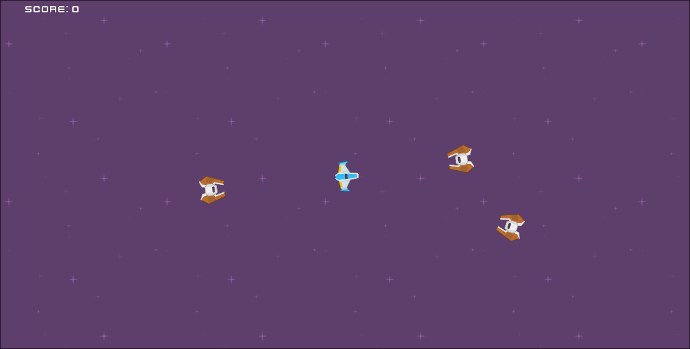
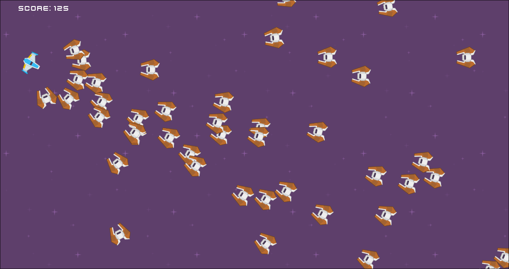

# Assignment One - Kamikaze Drones
> *By George Padron*

A simple space shooter game where you take control of the blue ship and blast away at hordes of endless kamikaze drones coming to destroy you!



## Installation Instructions
**Note:** Installation was only tested on Linux and Windows. Nevertheless, it should build just fine on MacOS

1. Ensure that you have all the necessary dependancies 
    - Godot 4.3 Mono 
    - Dotnet 9.0 SDK 
    - Scons 
    - Clang
    - GCC/G++ 
    - CMake and Make 
    - Ninja
    - Python 
2. Clone the repository
```bash
git clone "git@github.com:Vanderbilt-GameDev-2025/george-padron-assignment1.git" 
```

3. Ensure that the `godot-cpp` was pulled and synced properly

```bash
git submodule sync 
git submodule update --init --recursive
```

4. Build the GDExtension with `scons`. Replace `YOUR-VERSION-HERE` with your choice of `windows`, `linux`, etc. 

```
scons platform={YOUR-VERSION-HERE}
```
5. Open the `assignment-one-shooter` folder in Godot. You should now be able to play the game!

## Controls 

- **Move** with *WASD* or *Arrow Keys* 
- **Aim** with the mouse 
- **Fire** with *Left Mouse Button* 

## Functionality
- **Ship** that follows the mo
- **Sound Effects** for shooting and getting hit 
- **Full Music** That loops through game resets
- **Scoring** and loss mechanics 
- **Spawner** created using GDExtension 
    - Increases amount of enemies that appear in each wave over time
    - Intelligently ensures that enemies don't spawn either too close to the player or outside of the bounds of the game. 
- **Enemy AI** that tracks down the player



## Assets
- *Sprites and fonts* from [Kenny Space Shooter Redux Pack](https://kenney.nl/assets/space-shooter-redux).
- *Music* from [moodmode 8-bit game](https://pixabay.com/music/video-games-8-bit-game-158815/)
- *Enemy Hit Sound Effect* from [Cyberios on FreeSound.org](https://freesound.org/people/Cyberios/sounds/145788/)
- *Shoot Sound* Effect from [DWOBoyle on FreeSound.org](https://freesound.org/people/DWOBoyle/sounds/143611/)
- *Cursor* from *yours truly*.

## Video 
[](https://youtu.be/dJPxO5oq_s0)
