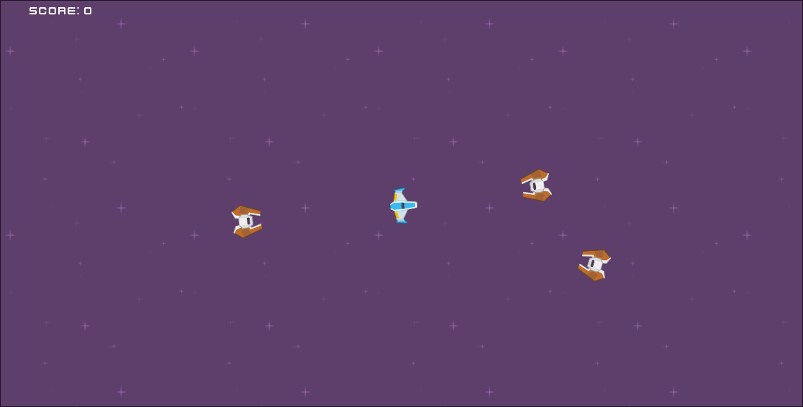

# Assignment One - Kamikaze Drones
> *By George Padron*

A simple space shooter game where you take control of the blue ship and blast away at hordes of endless kamikaze drones coming to destroy you!

## Controls 

- **Move** with *WASD* or *Arrow Keys* 
- **Fire** with *Left Mouse Button* 

## Functionality
- **Ship** that follows the mo
- **Sound Effects** for shooting and getting hit 
- **Full Music** That loops through game resets
- **Scoring** and loss mechanics 
- **Spawner** created using GDExtension 
    - Increases amount of enemies that appear in each wave over time
    - Intelligently ensures that enemies don't spawn either too close to the player or outside of the bounds of the game. 
- **Enemy AI** that tracks down the player

## Assets
- *Sprites and fonts* from [Kenny Space Shooter Redux Pack](https://kenney.nl/assets/space-shooter-redux).
- *Music* from [moodmode 8-bit game](https://pixabay.com/music/video-games-8-bit-game-158815/)
- *Enemy Hit Sound Effect* from [Cyberios on FreeSound.org](https://freesound.org/people/Cyberios/sounds/145788/)
- *Shoot Sound* Effect from [DWOBoyle on FreeSound.org](https://freesound.org/people/DWOBoyle/sounds/143611/)
- *Cursor* from *yours truly*.
